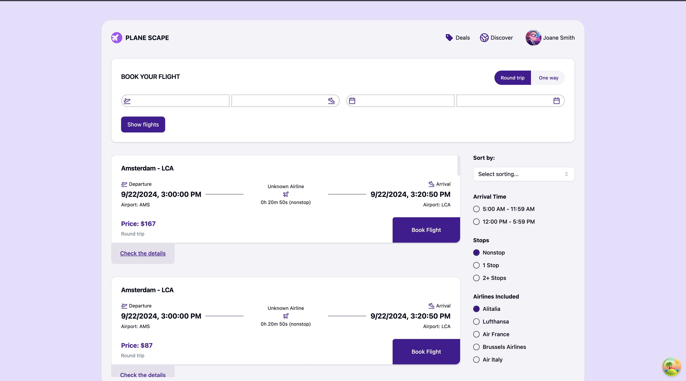
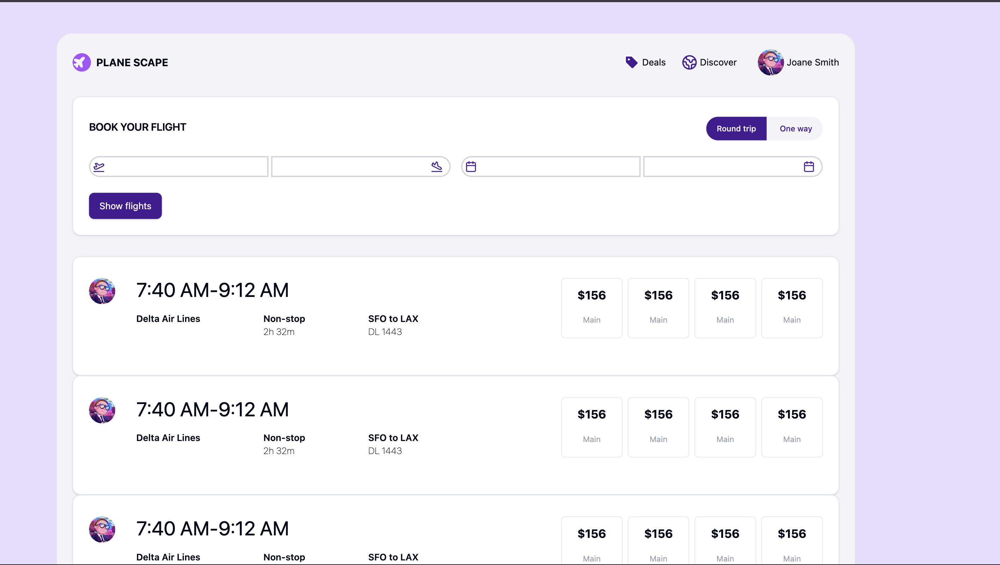

1. **Project Info:**
   - **Name**: `frontend-task`
   - **Version**: `0.0.1`
   - **Type**: `"module"` to indicate it's an ES module.

2. **Scripts:**
   - `"dev"`: Runs Vite's development server.
   - `"build"`: Compiles TypeScript (`tsc -b`) and builds the Vite project.
   - `"lint"`: Runs ESLint for code linting.
   - `"preview"`: Previews the Vite build.

3. **Dependencies**:
   - **Radix UI Components**: Provides various interactive elements like `Accordion`, `Checkbox`, `Dialog`, etc.
   - **React and React DOM**: `^18.3.1` version of React and React DOM for the project.
   - **State Management**: `zustand` is used for state management.
   - **Framer Motion**: For animations and transitions.
   - **Axios**: For making HTTP requests.
   - **React Router DOM**: For navigation.
   - **React Query**: For fetching, caching, and updating server state.
   - **Zod**: For schema validation.
   - **Tailwind CSS**: For utility-first CSS, along with `tailwindcss-animate` for animation utilities and `tailwind-merge` for merging Tailwind classes.

4. **Dev Dependencies**:
   - **ESLint & Plugins**: Ensures the code adheres to specified standards.
   - **TypeScript**: For static type-checking and better developer experience.
   - **Tailwind CSS and PostCSS**: For styling with Tailwind CSS and its PostCSS processor.
   - **Vite Plugin React**: Adds support for React in Vite.

5. **Screenshots**:

## Screenshots

This setup is well-suited for a modern React project, leveraging Tailwind CSS, TypeScript, and a solid build system with Vite.
